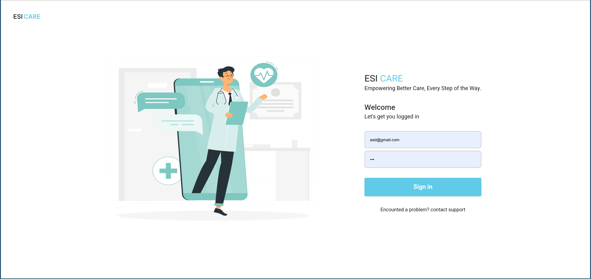
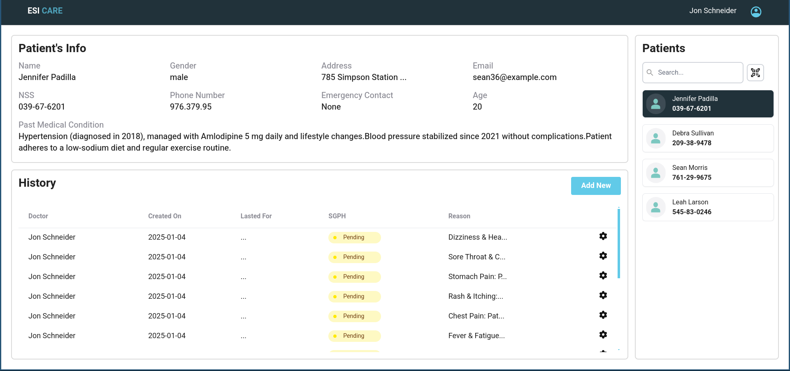
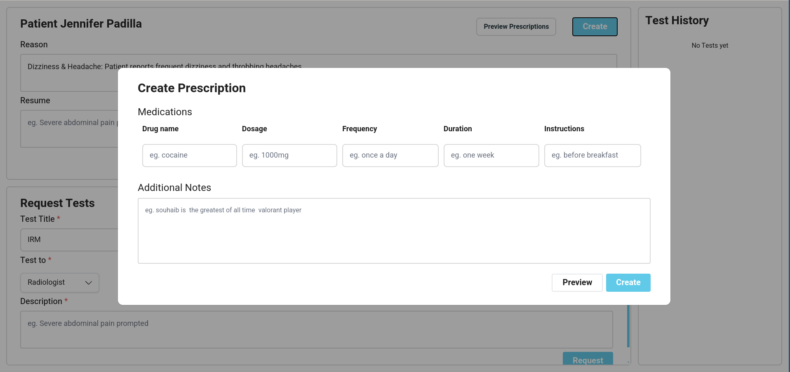
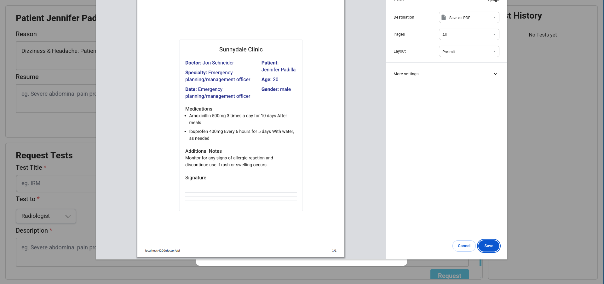
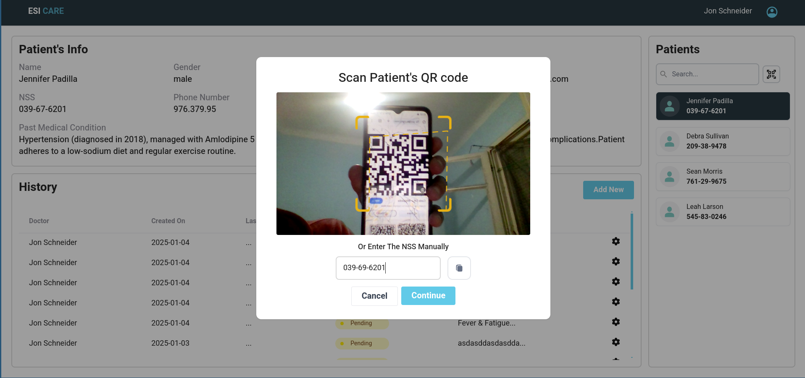

# EsiCare
A Hospital Managment System 


<p align="center">
  <a href="#key-features">Key Features</a> •
  <a href="#how-to-use">How To Use</a> •
  <a href="#download">Download</a> •
  <a href="#credits">Credits</a> •
  <a href="#related">Related</a> •
  <a href="#license">License</a> •
  <a href="#preview">Preview</a>
</p>

## Key Features

* **📝 Doctor Prescription Management**  
  - Create, edit, and print prescriptions seamlessly with patient-specific details.  
* **👨‍💼 Admin Management & Worker Creation**  
  - Admins can manage hospital staff, including doctors, nurses, and lab technicians.  
* **🔬 Radiologist, Biologist, and Nurse Tests**  
  - Streamline test requests and results between departments for efficient patient care.  
* **📊 Data Visualizations**  
  - Interactive graphs and charts for analyzing patient data and hospital performance.  
* **📲 QR Code Scanning**  
  - Quickly access patient records or prescriptions using QR codes for convenience.  
* **📂 DPI History for Patients**  
  - Maintain and view detailed patient history, including diagnoses, prescriptions, and tests.  
* **🏥 Central Hospital Management**  
  - Unified system for managing all hospital operations, from appointments to inventory.  
* **📈 Graphs and Printables**  
  - Generate printable reports and visual graphs for patient data and hospital analytics.  
* **🖥️ Cross-Platform Support**  
  - Accessible on Windows, macOS, and Linux for seamless hospital-wide usage.  
* **🖼️ Full Screen Mode**  
  - Work distraction-free with a full-screen interface for focused management.  
* **🔄 Real-Time Updates**  
  - Instantly see changes and updates across the system for efficient collaboration.  
* **🔒 Role-Based Access Control**  
  - Secure access to features based on user roles (admin, doctor, nurse, etc.).  


## How To Use

To clone and run this application, you'll need [Git](https://git-scm.com) and [Node.js](https://nodejs.org/en/download/) (which comes with [npm](http://npmjs.com)) installed on your computer. From your command line:

```bash
# Clone Repo
$ git clone https://github.com/EsiCare/Frontend.git

$ cd Frontend

# Install dependencies
$ npm install

# Run the app
$ npm start start
```


## Credits
This software uses the following open source packages:

- [Angular](http://electron.atom.io/)
- [Node.js](https://nodejs.org/)
- [QrAcanner](https://github.com/nimiq/qr-scanner)

## License

MIT

---


## Preview
| **Preview**                          | **Description**                                                                 |
|--------------------------------------|---------------------------------------------------------------------------------|
|           | Login screen for doctors and patients to access the system.                     |
|  | Dashboard for doctors to view patient records and manage prescriptions.         |
|  | Interface for doctors to create and issue new prescriptions.                    |
|  | Screen for doctors to print or download prescriptions for patients.             |
|  | QR code scanner for patients to quickly access their prescriptions or records.  |